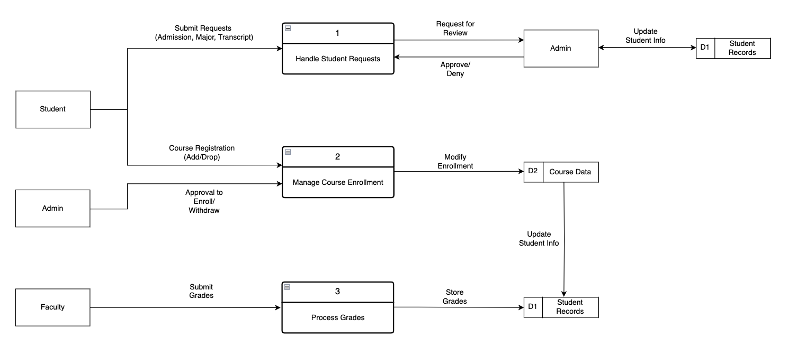
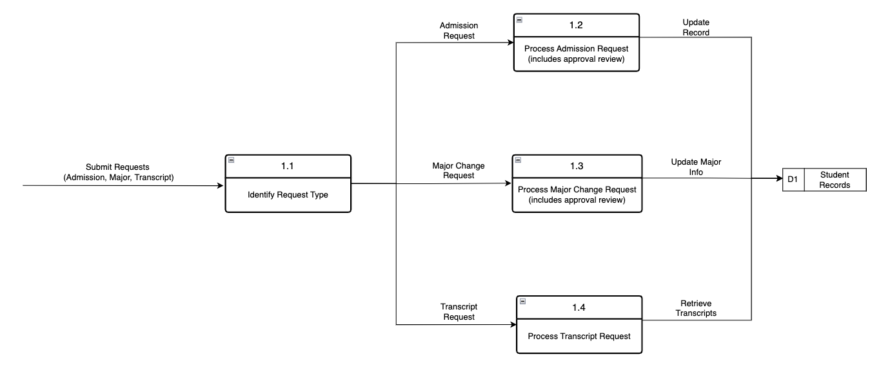

# CPS 310 - Phase 1: System Overview & Use Cases

## Authors
- Claire Summers
- Mason Euler
- Shayna Guilfoyle

## 1. Introduction

### a. Purpose
This document lays out a proposed system improvement for the University of Dayton’s student services. As students, we’ve all dealt with the headaches of applying, scheduling, withdrawing, and tracking grades. This system aims to simplify those processes and make life a little easier for everyone involved.

### b. Scope
This document covers an initial analysis of the system, including a context-level data flow diagram, an entity relationship model, and detailed use cases. It won’t go into implementation specifics but sets the foundation for system design.

### c. Definitions & Acronyms
- **DFD (Data Flow Diagram)**: A diagram showing how data moves through the system.
- **ERD (Entity Relationship Diagram)**: A visualization of the relationships between different system components.
- **Use Case**: A scenario that describes interactions between users and the system.
- **UD (University of Dayton)**: The institution this system is designed for.

### d. References
- University of Dayton student services documentation
- Class lectures and notes
- Canvas discussion board for user feedback

### e. Overview
This document is broken into sections that outline the system’s environment, functionality, and user interactions. It also includes diagrams that visually represent the system structure and use cases.

---

## 2. Overall Description

### a. Product Perspective
This system will integrate with existing UD services like the application portal, course scheduling system, and graduation management tools. The goal is to create a seamless, user-friendly experience.

### b. Product Functions
The system will handle:
- Submitting and tracking university applications
- Scheduling and managing courses
- Withdrawing from courses
- Submitting and accessing final grades
- Managing major change requests
- Viewing transcripts
- Applying for graduation
- Checking graduation requirements
- Submitting FAFSA

### c. User Characteristics
- **Students:** The primary users who interact with the system for scheduling, grades, and graduation.
- **Faculty & Advisors:** Responsible for approving class changes, major changes, and submitting grades.
- **Administrators:** Oversee applications, course availability, and graduation approvals.

### d. Constraints
- Must work with UD’s existing databases and authentication system.
- Needs to be accessible on both desktop and mobile.
- Must comply with FERPA regulations.

### e. Assumptions
- Users will have a basic understanding of online student systems.
- Existing student records and authentication will be used.
- The system will primarily serve current and prospective students, faculty, and staff.

---

## 3. Systems Analysis

### a. Context-Level Data Flow Diagram


### b. Context-Level Entity Relationship Diagram


### c. Use Cases

#### i. Use Case Scenarios

1. **Apply to University**
   - **Actors:** Student, Administration  
   - **Description:** As a prospective student, I want to submit an application online so that I can be considered for admission.  
   - **Trigger:** The student decides to apply to a university.  
   - **Preconditions:**  
      - The university’s application portal must be operational.  
      - The student must have access to required documents (transcripts, essays, etc.).  
   - **Steps:**  
      1. The student accesses the university’s admissions portal.  
      2. The student creates an account or logs into an existing account.  
      3. The student fills out the application form.  
      4. The student uploads required documents.  
      5. The student pays the application fee (if applicable).  
      6. The student submits the application.  
      7. The administration reviews the application and provides an acknowledgment.  
   - **Postconditions:**  
      - The application is stored in the admissions system.  
      - The student receives a confirmation email or notification.  
   - **Assumptions:**  
      - The payment system for application fees is functioning properly.  

---

2. **Schedule Classes**
   - **Actors:** Student, Administration  
   - **Description:** As a student, I want to schedule classes so that I can complete my degree requirements.  
   - **Trigger:** The course registration period begins, or the student needs to modify their schedule.  
   - **Preconditions:**  
      - The student must be an active, enrolled student.  
      - The registration system must be available.  
   - **Steps:**  
      1. The student logs into the registration system.  
      2. The student searches for available courses.  
      3. The student selects desired courses.  
      4. The system checks for prerequisites and time conflicts.  
      5. The student confirms their schedule and submits the registration.  
      6. The system updates the student’s schedule and generates a confirmation.  
   - **Postconditions:**  
      - The student’s course schedule is updated in the system.  
      - The student receives a confirmation of their registered classes.  
   - **Assumptions:**  
      - Course seats are available.  

---

3. **Withdraw from a Class**
   - **Actors:** Student, Administration  
   - **Description:** As a student, I want to withdraw from a class so that I can adjust my academic plan.  
   - **Trigger:** The student decides they no longer want to continue a class.  
   - **Preconditions:**  
      - The withdrawal period must be open.  
   - **Steps:**  
      1. The student logs into the academic portal.  
      2. The student navigates to their class schedule.  
      3. The student selects the class they want to withdraw from.  
      4. If required, the system notifies administration for approval.  
      5. The administration reviews the request and provides guidance.  
      6. Upon approval, the system processes the withdrawal and updates the student’s record.  
   - **Postconditions:**  
      - The class is removed from the student’s active schedule.  
      - The student’s transcript reflects a withdrawal (if applicable).  
   - **Assumptions:**  
      - The student understands the financial and academic consequences of withdrawing.  

---

4. **Submit Final Grades**
   - **Actors:** Faculty, Administration  
   - **Description:** As a professor, I want to submit final grades so that student records are updated.  
   - **Trigger:** The end of the academic term is reached.  
   - **Preconditions:**  
      - The professor must have access to the grading system.  
   - **Steps:**  
      1. The professor logs into the grading system.  
      2. The professor selects the course they are teaching.  
      3. The professor enters final grades for each student.  
      4. The professor reviews and confirms the submitted grades.  
      5. The system updates student records and notifies administration.  
   - **Postconditions:**  
      - The students’ transcripts are updated with final grades.  
      - Administration has access to the submitted grades for official records.  

---

5. **Change Major**
   - **Actors:** Student, Administration  
   - **Description:** As a student, I want to submit a major change request so that I can switch academic programs.  
   - **Trigger:** The student decides to change their major.  
   - **Steps:**  
      1. The student schedules a meeting with an advisor.  
      2. The advisor reviews the student’s request and provides guidance.  
      3. The student submits a major change request form.  
      4. Administration approves the request.  
      5. The system updates the student’s academic record.  
      6. The student receives confirmation of the major change.  

---

6. **View Transcript**
   - **Actors:** Student, Administration  
   - **Description:** As a student, I want to view my transcript so that I can track my academic progress.  
   - **Trigger:** The student wants to check their academic history.  
   - **Steps:**  
      1. The student logs into the student portal.  
      2. The student navigates to the transcript section.  
      3. The system retrieves and displays the student's academic record.  
      4. The student can view, download, or request an official transcript.  

---

7. **Apply for Graduation**
   - **Actors:** Student, Administration  
   - **Description:** As a student, I want to apply for graduation so that I can receive my degree.  
   - **Trigger:** The student reaches the final semester of their program.  
   - **Preconditions:**  
      - The student must have completed (or be on track to complete) all graduation requirements.  
   - **Steps:**  
      1. The student logs into the academic portal.  
      2. The student verifies that they have met all graduation requirements.  
      3. The student fills out and submits the graduation application.  
      4. Administration reviews the application.  
      5. The student receives confirmation of application approval or notification of missing requirements.  
      6. If approved, the student receives further instructions on commencement and diploma issuance.  
   - **Postconditions:**  
      - The student’s graduation status is recorded.  

---

8. **Check Graduation Requirements**
   - **Actors:** Student, Administration  
   - **Description:** As a student, I want to check my graduation requirements so that I know what courses I still need to complete.  
   - **Trigger:** The student wants to verify their progress toward graduation.  
   - **Steps:**  
      1. The student logs into the academic portal.  
      2. The student navigates to the degree audit section.  
      3. The system displays completed and remaining graduation requirements.  
      4. The student reviews the information and consults an advisor if needed.  

---

9. **Submit FAFSA**
   - **Actors:** Student, Administration  
   - **Description:** As a student, I want to submit my FAFSA so that I can receive financial aid.  
   - **Trigger:** The FAFSA application period begins or the student needs financial aid.  
   - **Preconditions:**  
      - The student must have a valid Social Security Number (or eligible non-citizen status).  
   - **Steps:**  
      1. The student accesses the FAFSA website.  
      2. The student logs in or creates an account.  
      3. The student fills out the FAFSA form, including financial and personal information.  
      4. The student submits required documentation (e.g., tax returns, income verification).  
      5. The system processes the application and generates a confirmation.  
      6. Administration receives and reviews the application.  
      7. The student is notified of their financial aid award status.  
   - **Postconditions:**  
      - The FAFSA application is submitted and processed.  

#### ii. Use Case Diagram


---

## 4. Conclusion
This document lays out the initial system proposal, covering its key functions, interactions, and data relationships. Future phases will refine these details and develop a more comprehensive system design.

---

# Phase 2: Data Flow Diagrams, Data Dictionary, Process Specification

---

## 1. Data Flow Diagrams  
### a. Diagram 0 (System-Level Decomposition)  


### b. Child Diagram 1 (Process 1: Handle Student Requests)  


### c. Child Diagram 2 (Process 2: Manage Course Enrollment) 


## 2. Data Dictionary

### Data Flow Descriptions

### Submit Requests (Admission, Major, Transcript)
- **Description**: This action is triggered by the student and allows them to request multiple actions. The actions that can be requested are: Applying for University, major change, and viewing a transcript.
- **Source**: Student Entity
- **Destination**: Handle Student Requests Process
- **DS**: StudentRecord, Transcript Record
- **Comments**:

### Course Registration
- **Description**: This flow handles a student requesting to either add or drop a course.
- **Source**: Student Entity
- **Destination**: Manage Course Enrollment Process
- **DS**: CourseRegistrationRequest
- **Comments**:

### Request for Review
- **Description**: Grabs the student’s request and sends them to Admin for review.
- **Source**: Handle Student Requests Process
- **Destination**: Admin Entity
- **DS**: StudentRecord
- **Comments**:

### Approve/Deny
- **Description**: Grabs the decision to approve or deny the request from admin and hands it to the process to get the requests handled.
- **Source**: Admin Entity
- **Destination**: Handle Student Requests Process
- **DS**: CourseRegistrationRequest
- **Comments**:

### Update Student Info
- **Description**: This flow updates the students’ data in the student records data store.
- **Source**: Admin entity/ Student Records data store
- **Destination**: Admin entity/ Student Records data store
- **DS**: StudentRecord
- **Comments**:

### Approval to Enroll/Withdraw
- **Description**: This data flow allows administrators to approve a student to enroll or withdraw from a course.
- **Source**: Admin entity
- **Destination**: Manage Course Enrollment process
- **DS**: WaitlistEntry, CourseData, CourseRegistrationRequest
- **Comments**:

### Modify Enrollment
- **Description**: This flow updates the Course Data store after Administration approves a course change, or a student’s request to add/drop a course.
- **Source**: Manage Course Enrollment process
- **Destination**: Course Data store
- **DS**: CourseData
- **Comments**:

### Update Student Info
- **Description**: The new Course Data gets entered into the student records.
- **Source**: Course Data store
- **Destination**: Student Records data store
- **DS**: StudentRecord
- **Comments**:

### Submit Grades
- **Description**: The action of faculty submitting their final grades to get processed.
- **Source**: Faculty entity
- **Destination**: Process Grades process
- **DS**: GradeSubmission
- **Comments**:

### Store Grades
- **Description**: Takes the grades that the faculty have submitted and stores them into the student records.
- **Source**: Process Grades process
- **Destination**: Student Records data store
- **DS**: GradeSubmission
- **Comments**:

### Admission Request
- **Description**: Takes the student’s request and transfers it to get approved.
- **Source**: Identify Request Type process
- **Destination**: Process Admission Request process
- **DS**: StudentRecord
- **Comments**:

### Major Change Request
- **Description**: Takes the student’s request to change major and transfers it to the next process to get it approved.
- **Source**: Identify Request Type process
- **Destination**: Process Major Change Request process
- **DS**: StudentRecord
- **Comments**:

### Transcript Request
- **Description**: Takes the student’s request to obtain transcript and transfers it to the next process to get it approved.
- **Source**: Identify Request Type process
- **Destination**: Process Transcript Request
- **DS**: TranscriptRecord (TranscriptRequestTimestamp)
- **Comments**:

### Update Record
- **Description**: Makes physical changes to show acceptance in the student records.
- **Source**: Process Admission Request process
- **Destination**: Student Records data store
- **DS**: StudentRecord
- **Comments**:

### Update Major Info
- **Description**: Updates the major of the student in the student records.
- **Source**: Process Major Change Request process
- **Destination**: Student Records data store
- **DS**: StudentRecord
- **Comments**:

### Retrieve Transcripts
- **Description**: Retrieves the students’ transcript from the Students’ records.
- **Source**: Process Transcript Request process
- **Destination**: Student Records data store
- **DS**: TranscriptRecord
- **Comments**:

### Enrollment Request
- **Description**: Starts the Enrollment process by letting the prerequisite validation process know which course is being requested.
- **Source**: Process Registration Request process
- **Destination**: Validate Prerequisites process
- **DS**: EnrollmentRecord

### Withdraw Request
- **Description**: If the student is requesting to withdraw from a course, this flow will start processing the withdrawal request immediately.
- **Source**: Process Registration Request process
- **Destination**: Process Withdrawal Request process
- **DS**: EnrollmentRecord

### Prereqs Met
- **Description**: If the prerequisites are met, this flow moves to the next step to verify seat availability.
- **Source**: Validate Prerequisites process
- **Destination**: Verify Seat Availability process
- **DS**: CourseRegistrationRequest, CourseData

### Prereqs Not Met
- **Description**: If the prerequisites are not met, this flow moves to the next step to reject the enrollment request.
- **Source**: Validate Prerequisites process
- **Destination**: Reject Enrollment Request process
- **DS**: CourseData, StudentRecord

### Seats Available
- **Description**: If there are seats available, the student will be enrolled into the course.
- **Source**: Verify Seat Availability process
- **Destination**: Enroll Student process
- **DS**: CourseData, EnrollmentRecord

### Class Full
- **Description**: If the class is full, the student will get added to the waitlist.
- **Source**: Verify Seat Availability process
- **Destination**: Add to Waitlist process
- **DS**: CourseData, WaitlistEntry

### Update
- **Description**: Transfers the new enrollment/withdrawal data to update the data stores.
- **Source**: Enroll Student/Process Withdrawal Request/Course Data store
- **Destination**: Course Data store & Student Records data store
- **DS**: CourseData, EnrollmentRecord, StudentRecord

### Add to Waitlist
- **Description**: Will add the student to the waitlist and update the course data to display that information.
- **Source**: Add to Waitlist process
- **Destination**: Course Data store
- **DS**: WaitlistEntry, CourseData


---

### Data Structures

**1. CourseRegistrationRequest**  
CourseRegistrationRequest = 
         StudentID + 
         CourseID + 
         Term + 
         RequestType + 
         Timestamp

- **StudentID** = Unique identifier for the student  
- **CourseID** = Unique identifier for the course  
- **Term** = Semester and year (e.g., Fall 2025)  
- **RequestType** = [Add; Drop; Withdraw]  
- **Timestamp** = Date and time of the request

**2. StudentRecord**  
StudentRecord = StudentID + StudentName + Major + {EnrolledCourses} + Transcript

- **StudentName** = First Name + (Middle Initial) + Last Name  
- **EnrolledCourses** = {CourseID + Section + Term + Status}  
- **Transcript** = {CourseID + Term + Grade}

**3. GradeSubmission**  
GradeSubmission = CourseID + FacultyID + {StudentGrade}

- **StudentGrade** = StudentID + Grade + SubmissionTimestamp  
- **Grade** = [A; B; C; D; F; NC; W]

**4. WaitlistEntry**  
WaitlistEntry = CourseID + StudentID + WaitlistTimestamp + PriorityLevel

- **PriorityLevel** = [1; 2; 3...] depending on order of request

**5. CourseData**  
CourseData = CourseID + Title + Credits + Prerequisites + Capacity + {EnrollmentInfo} + Waitlist

- **Prerequisites** = {CourseID}  
- **EnrollmentInfo** = {StudentID + Status}  
- **Waitlist** = {WaitlistEntry}

**6. TranscriptRecord**  
TranscriptRecord = StudentID + {CourseID + Term + Grade} + GPA + TranscriptRequestTimestamp

- **GPA** = Cumulative grade point average for the student  
- **TranscriptRequestTimestamp** = Time the transcript was requested

**7. EnrollmentRecord**  
EnrollmentRecord = StudentID + CourseID + Term + Status + EnrollmentDate + (WithdrawalDate)

- **Status** = [Enrolled; Withdrawn; Waitlisted]  
- **EnrollmentDate** = Date the student was enrolled  
- **WithdrawalDate** = If applicable, when the student withdrew

**Algebraic Notation Key:**

- `=` means "is composed of"  
- `+` means "and"  
- `{}` means repeating elements  
- `[]` means mutually exclusive options  
- `()` means optional element

---

## Data Store Descriptions

### Student Records
- **ID**: D1
- **Name**: Student Record
- **Description**: Houses all of the Student’s information. Includes: Student ID, name, Major info, Transcript, Course list, and more.
- **DS**: StudentRecord

### Course Data
- **ID**: D2
- **Name**: Course Data
- **Description**: Holds information for each course offered. Includes: Class size, prerequisites, credits, enrollment info, and more.
- **DS**: CourseData

---

### Data Element Descriptions

- **StudentID**
  - **Aliases**: SID
  - **Description**: A unique identifier assigned to each student in the system.
  - **Base or Derived**: Base
  - **Type of Data**: Integer
  - **Validation Criteria**: Must be a valid 9-digit integer.
  - **Default Value**: N/A
  - **Comments**: Uniquely identifies a student in the system.

- **CourseID**
  - **Aliases**: CRN
  - **Description**: A unique identifier for each course offered.
  - **Base or Derived**: Base
  - **Type of Data**: Integer
  - **Validation Criteria**: Must be a valid course identifier in the system.
  - **Default Value**: N/A
  - **Comments**: Refers to a specific course being requested by the student.

- **Term**
  - **Aliases**: Semester, Academic Term
  - **Description**: Represents the semester and year in which the course is offered (e.g.,    Fall 2025).
  - **Base or Derived**: Base
  - **Type of Data**: String
  - **Validation Criteria**: Format must be "Season Year" (e.g., "Fall 2025").
  - **Default Value**: N/A
  - **Comments**: Used to categorize courses based on academic term.

- **RequestType**
  - **Aliases**: Enrollment Action
  - **Description**: Specifies the type of request being made (Add, Drop, or Withdraw).
  - **Base or Derived**: Base
  - **Type of Data**: String
  - **Validation Criteria**: Must be one of the following values: "Add", "Drop", "Withdraw".
  - **Default Value**: N/A
  - **Comments**: Defines the nature of the course registration action.

- **Timestamp**
  - **Aliases**: Request Time
  - **Description**: The date and time when the course registration request was made.
  - **Base or Derived**: Base
  - **Type of Data**: DateTime
  - **Validation Criteria**: Must be a valid DateTime format.
  - **Default Value**: N/A
  - **Comments**: Used to track when the request was initiated.

---

## 3. Process Specifications

### 1. Handle Student Requests
- **Description**: Manages student-initiated actions such as admission applications, major changes, and transcript requests.
- **Input Flows**: Submit Requests (Admission, Major, Transcript)
- **Output Flows**: Request for Review (to Admin), Approval/Deny (from Admin), Update Student Info
- **Structured Decision**: Uses Structured English for admin approval logic (see below)
- **Comments**: May require access to student data and request types

### 1.1 Identify Request Type
- **Description**: Determines whether the student request is for admission, major change, or transcript.
- **Input Flows**: Submit Requests (Admission, Major, Transcript)
- **Output Flows**: Admission Request, Major Change Request, Transcript Request
- **Comments**: This process directs the request to the correct handling sub-process.

### 1.2 Process Admission Request
- **Description**: Reviews student admission requests and updates records upon approval.
- **Input Flows**: Admission Request
- **Output Flows**: Update Record
- **Comments**: Includes administrative review; approval decision may come from external admin.

### 1.3 Process Major Change Request
- **Description**: Processes requests from students wishing to change their major.
- **Input Flows**: Major Change Request
- **Output Flows**: Update Major Info
- **Comments**: Requires access to Student Records and Admin approval flow.

### 1.4 Process Transcript Request
- **Description**: Handles requests for official transcripts and retrieves data from student records.
- **Input Flows**: Transcript Request
- **Output Flows**: Retrieve Transcripts
- **Comments**: May involve formatting and validation of academic data.

### 2. Manage Course Enrollment
- **Description**: Oversees registration, withdrawal, prerequisite validation, enrollment updates, and waitlisting.
- **Input Flows**: Course Registration Info, Approval to Enroll/Withdraw
- **Output Flows**: Modify Enrollment, Update Student Info
- **Structured Decision**: Refer to Decision Tree for path logic and Decision Table for enrollment vs. waitlist conditions
- **Comments**: Expanded in Child Diagram 2

### 2.1 Process Registration Request
- **Description**: Parses incoming registration info and forwards it for validation.
- **Input Flows**: Course Registration Info, Approval to Enroll/Withdraw
- **Output Flows**: Enrollment Request

### 2.2 Validate Prerequisites
- **Description**: Checks if the student meets prerequisites for the requested course.
- **Input Flows**: Enrollment Request
- **Output Flows**: Prereqs Met, Prereqs Not Met, Withdrawal Request
- **Structured Decision**: See Decision Table for validation logic

### 2.3 Verify Seat Availability
- **Description**: Checks current enrollment and determines if space is available in the course.
- **Input Flows**: Prereqs Met
- **Output Flows**: Seats Available, Class Full

### 2.4 Enroll Student
- **Description**: Updates student records and course data to finalize enrollment.
- **Input Flows**: Seats Available
- **Output Flows**: Update Student Records, Update Course Data

### 2.5 Add to Waitlist
- **Description**: Adds the student to the waitlist if a class is full.
- **Input Flows**: Class Full
- **Output Flows**: Add to Waitlist

### 2.6 Reject Enrollment Request
- **Description**: Rejects the enrollment if prerequisites are not met.
- **Input Flows**: Prereqs Not Met
- **Output Flows**: Rejection Notification (not shown in diagram but implied)

### 2.7 Process Withdrawal Request
- **Description**: Removes student from a course and updates records accordingly.
- **Input Flows**: Withdrawal Request
- **Output Flows**: Update Course Data, Update Student Records

### 3. Process Grades
- **Description**: Accepts grade submissions from faculty and updates student records accordingly.
- **Input Flows**: Submit Grades
- **Output Flows**: Store Grades
- **Comments**: Tied to faculty input and Student Record update

---

## 4. Structured Decision Techniques

To support the decision-making logic within the system, the following structured techniques have been applied:

### 4.1 Structured English – For Admin Approval Logic (Process 1)
```text
IF Request.Type = "Transcript"
  THEN Auto-Approve
ELSE IF Request.Type = "Major Change" OR Request.Type = "Admission"
  THEN Send to Admin for Manual Review
ENDIF
```
**Used in**: 1. Handle Student Requests

---

### 4.2 Decision Table – For 2.2 and 2.3 Combined Logic (Validate Prerequisites & Verify Seat Availability)
| Prerequisites Met | Seats Available | Action            |
|-------------------|------------------|-------------------|
| Yes               | Yes              | Enroll Student    |
| Yes               | No               | Add to Waitlist   |
| No                | --               | Reject Request    |

**Used in**: 2.2 Validate Prerequisites, 2.3 Verify Seat Availability

---

### 4.3 Decision Tree – Enrollment Outcomes
```text
                ┌───────────────┐
                │Prereqs Met?   │
                └──────┬────────┘
                       │ Yes
               ┌───────▼────────┐
               │Seats Available?│
               └───────┬────────┘
            Yes        │        No
            ▼          ▼         ▼
        Enroll      Waitlist   Reject
```

**Used in**: 2.2 / 2.3 – To visually support conditional outcomes from prerequisite and seat availability checks.

---

> These three techniques demonstrate different formats used for decision logic in system processes. Additional processes without complex branching did not require structured decisions.


